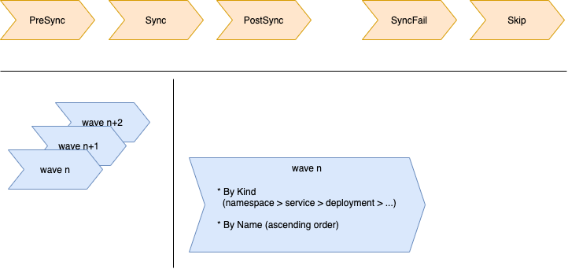

= OpenShift Recipes: ArgoCD Demo
:toc: macro
:toclevels: 4
:sectlinks:
:sectanchors:

Demo to showcase some features in ArgoCD

toc::[]

== Overview

Deploys an ArgoCD App with some specific ArgoCD features

|===
| Title | ArgoCD Demo
| Status | In testing 
| Deploy Model | kustomize
| Dependencies | n/a
| OCP Version | >= 4.8
|===

== Preparation

* for ArgoCD, `kustomizeBuildOptions: '--enable-helm'` in `ArgoCD` resource

== Details

=== ArgoCD Waves and Hooks

ArgoCD provides with waves and hook the possibility to influence the order

[source,yaml]
----
  annotations:
    # PreSync, Sync, PostSync, FailSync, Skip
    argocd.argoproj.io/hook: PostSync
    # HookSucceeded, HookFailed, BeforeHookCreation (default)
    argocd.argoproj.io/hook-delete-policy: HookSucceeded
    argocd.argoproj.io/sync-wave: "1"
----

The special hooks

* `SyncFail` in case the sync operation fails; to execute clean-up and finalizers
* `Skip` indicates to skip this resource manifest

== Summary

Recipe installed.

== References

N/A

== Open

N/A

== License

This article is licensed under the Apache License, Version 2.
Separate third-party code objects invoked within this code pattern are licensed by their respective providers pursuant
to their own separate licenses. Contributions are subject to the
link:https://developercertificate.org/[Developer Certificate of Origin, Version 1.1] and the
link:https://www.apache.org/licenses/LICENSE-2.0.txt[Apache License, Version 2].

See also link:https://www.apache.org/foundation/license-faq.html#WhatDoesItMEAN[Apache License FAQ]
.
