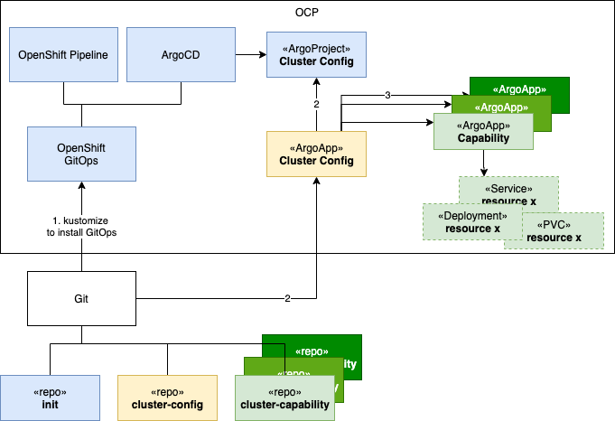

= OpenShift Recipes
:author: Hafid Haddouti
:toc: macro
:toclevels: 4
:sectlinks:
:sectanchors:

Collection of OpenShift recipes to manage common/infrastructure workload

toc::[]

== Overview

Using GitOps to manage a Kubernetes/OpenShift cluster with the cross-cutting capabilities like Pipeline, Secret Management or similar.
For the realization of the GitOps principles basically ArgoCD is used. In the current state the link:https://docs.openshift.com/container-platform/4.7/cicd/gitops/gitops-release-notes.html[OpenShift GitOps] option is used, which integrates ArgoCD and Pipeline.

The idea of the solution to manage a Kubernetes/OpenShift cluster in the GitOps way has the following pillars

* link:01-init[Init]: which installs the minium tools to support GitOps, here ArgoCD using the `Red Hat OpenShift GitOps`
* link:02-cluster-config[Cluster Config]: The ArgoCD project and app which will manage the cluster and maintain the capabilities. Here is the list of wanted capabilities defined - the descriptive state of your cluster.
* link:03-cluster-capabilities[Cluster Capabilities]: All the possible (cross-cutting) capabilities. Usually this is an own repository and not project specific.

Figure <<figure1>> visualize the relation between the repositories and configuration artifacts.

[[figure1, Overview solution]]

== Installation

To prepare your (new) cluster follow only the 2 steps:

. Configure the `cluster-config.json` in link:02-cluster-config[Cluster Config] to select the desired state (and capabilities). Some capability examples are in link:03-cluster-capabilities[Cluster Capabilities], any other repository is how ever possible.
. Apply the init as stated in the instruction in link:01-init[Init] to install the foundation (ArgoCD and the bootstrap config).

== Known Issues

=== ArgoCD and Waves

Some capabilities use ArgoCD wave logic to define the order. Since ArgoCD 1.8 this results in some issues if wave and specific resources like `Namespaces` are used. See for details link:https://github.com/argoproj/argo-cd/issues/3781[issue] and link:https://github.com/argoproj/argo-cd/blob/master/docs/operator-manual/health.md#argocd-app[docu].

[source,yaml]
.Adjust the existing `argocd-cm`
----
---
apiVersion: v1
kind: ConfigMap
metadata:
  name: argocd-cm
  namespace: openshift-gitops
  labels:
    app.kubernetes.io/name: argocd-cm
    app.kubernetes.io/part-of: argocd
data:
  resource.customizations: |
    argoproj.io/Application:
      health.lua: |
        hs = {}
        hs.status = "Progressing"
        hs.message = ""
        if obj.status ~= nil then
          if obj.status.health ~= nil then
            hs.status = obj.status.health.status
            if obj.status.health.message ~= nil then
              hs.message = obj.status.health.message
            end
          end
        end
        return hs
----

.Or the `ArgoCD` instance
----
apiVersion: argoproj.io/v1alpha1
kind: ArgoCD
metadata:
  name: openshift-gitops  
spec:
  # ...
  resourceCustomizations: |
    argoproj.io/Application:
      health.lua: |
        hs = {}
        hs.status = "Progressing"
        hs.message = ""
        if obj.status ~= nil then
          if obj.status.health ~= nil then
            hs.status = obj.status.health.status
            if obj.status.health.message ~= nil then
              hs.message = obj.status.health.message
            end
          end
        end
        return hs
----

.Or create a new with the `argocd-cm` annotation
----
$ cat <<EOF | kubectl apply -f -
apiVersion: v1
kind: ConfigMap
metadata:
  name: custom-argocd-cm
  namespace: openshift-gitops
  labels:
    app.kubernetes.io/name: argocd-cm
    app.kubernetes.io/part-of: argocd
data:
  resource.customizations: |
    argoproj.io/Application:
      health.lua: |
        hs = {}
        hs.status = "Progressing"
        hs.message = ""
        if obj.status ~= nil then
          if obj.status.health ~= nil then
            hs.status = obj.status.health.status
            if obj.status.health.message ~= nil then
              hs.message = obj.status.health.message
            end
          end
        end
        return hs
EOF
----

== Summary

GitOps approach also for maintaining Kubernetes Clusters. Reusability. Idempotent results.

== References

N/A

== Open

N/A

== License

This article is licensed under the Apache License, Version 2.
Separate third-party code objects invoked within this code pattern are licensed by their respective providers pursuant
to their own separate licenses. Contributions are subject to the
link:https://developercertificate.org/[Developer Certificate of Origin, Version 1.1] and the
link:https://www.apache.org/licenses/LICENSE-2.0.txt[Apache License, Version 2].

See also link:https://www.apache.org/foundation/license-faq.html#WhatDoesItMEAN[Apache License FAQ]
.
